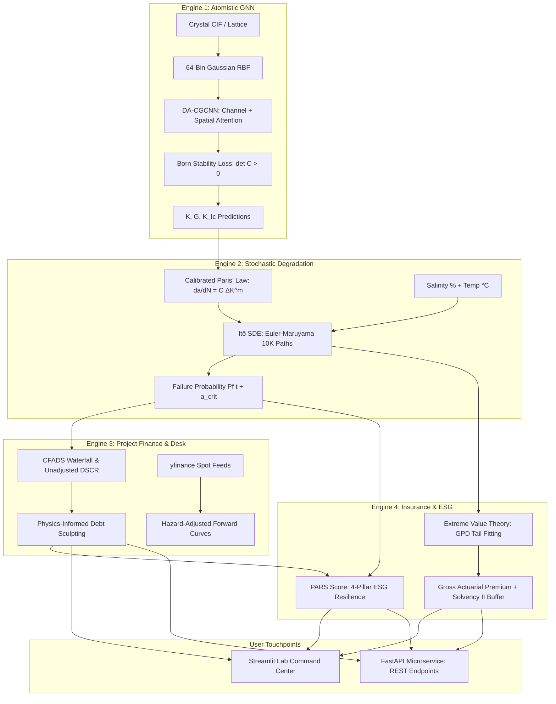

# MatRisk AI: Atomistic-to-Financial Asset Resilience & Risk Engine

[](https://www.python.org/)
[](https://pytorch-geometric.readthedocs.io/)
[](https://fastapi.tiangolo.com/)
[](https://streamlit.io/)
[](https://www.docker.com/)
[](https://opensource.org/licenses/MIT)
[](https://docs.pytest.org/)

> **A unified, cross-domain quantitative platform that translates quantum-mechanical crystal graph properties into stochastic structural failure mechanics, corporate debt service coverage ratios (DSCR), and actuarial catastrophe insurance premiums.**

---

## 📌 Executive Summary

Traditional financial risk management and commodity trading desks evaluate capital assets (offshore wind turbines, nuclear pressure vessels, marine pipelines, aerospace frames) using **static historical failure rates** and Gaussian assumptions. 

In reality, structural failure is governed by **sub-critical microstructural crack kinetics**: power-law fracture growth driven by environmental chemistry (chloride stress-corrosion cracking) and cyclic thermal-mechanical load swings. Ignoring this creates fat-tailed catastrophe events that trigger unexpected loan defaults and insurance insolvency.

**MatRisk AI solves this through a 5-tier physics-to-finance cascade:**
1. **Atomistic GNN Engine**: Predicts bulk modulus ($K$), shear modulus ($G$), and critical fracture toughness ($K_{Ic}$) directly from crystal lattices using a Dual-Attention Crystal Graph Convolutional Network (DA-CGCNN) constrained by Born mechanical stability ($\det(\mathbf{C}) > 0$).
2. **Stochastic Degradation Engine**: Solves 10,000 Itô Stochastic Differential Equation (SDE) trajectories via Euler-Maruyama to generate dynamic failure curves $P_f(t)$ and hazard rates $\lambda(t)$.
3. **Project Finance Engine**: Maps dynamic physical downtime into Cash Flow Available for Debt Service ($\text{CFADS}_t$) and runs real-time **AI Debt Sculpting** to dynamically adjust principal amortization and maintain bank covenants ($\text{DSCR} \ge 1.30\text{x}$).
4. **Actuarial EVT Engine**: Fits Generalized Pareto Distributions (GPD) using Extreme Value Theory to quantify 99% Value at Risk ($\text{VaR}_{0.99}$) and Expected Shortfall ($\text{ES}_{0.99}$).
5. **ESG Resilience Rating ($\text{PARS}$)**: Produces an audit-ready 4-pillar credit-style resilience score ($0\text{--}100$, AAA to CCC/D).

---

## 🏛 Platform Architecture



---

## 🔬 Mathematical Formulations

### 1. Born Mechanical Stability Loss
To ensure predicted elastic stiffness tensors $\mathbf{C}$ are strictly physical and non-negative definite:
$$\mathcal{L}_{\text{Born}} = \text{ReLU}\left(-\det(\mathbf{C}) + \epsilon\right) + \sum_{i} \text{ReLU}(-C_{ii})$$

### 2. Microstructural Crack Kinetics (Itô SDE)
Vectorized stochastic crack propagation under cyclic stress $\Delta \sigma$ and environmental corrosive acceleration $\beta_{\text{env}}$:
$$da_t = \beta_{\text{env}} \cdot C \cdot \left[ Y \Delta \sigma \sqrt{\pi a_t} \right]^m \omega \, dt + \sigma_{\text{noise}} \cdot a_t \, dW_t$$
where catastrophic brittle fracture occurs when the crack reaches critical depth:
$$a_{\text{crit}} = \frac{1}{\pi} \left( \frac{K_{Ic}}{Y \cdot \sigma_{\max}} \right)^2$$

### 3. Project Finance CFADS & Dynamic Debt Sculpting
Cash Flow Available for Debt Service accounts for downtime revenue loss and wear-driven CapEx spikes:
$$\text{CFADS}_t = \left(\text{Revenue}_t \cdot [1 - P_f(t)]\right) - \text{OpEx}_t - \text{CapEx}_{\text{maint}}(a_t) - \text{Taxes}_t$$
To prevent debt covenant default ($\text{DSCR}_t < 1.05\text{x}$) or equity dividend lock-up ($\text{DSCR}_t < 1.20\text{x}$), principal amortization $P_t$ is dynamically sculpted:
$$P_t = \max\left(0, \frac{\text{CFADS}_t}{\text{DSCR}_{\text{target}}} - I_t\right)$$

### 4. Extreme Value Theory (EVT) Tail Pricing
Actuarial capital buffers and excess tail losses are modeled using the Generalized Pareto Distribution:
$$G_{\xi, \beta}(y) = 1 - \left( 1 + \frac{\xi y}{\beta} \right)^{-1/\xi}$$
$$\text{VaR}_{\alpha} = u + \frac{\beta}{\xi} \left[ \left( \frac{N}{N_u} (1 - \alpha) \right)^{-\xi} - 1 \right]$$

---

## 📊 Backtesting Proof: Kupiec POF Likelihood Ratio Test

To validate that microstructural physics reduces financial risk estimation errors, we performed a quantitative backtest comparing the **MatRisk Physics-Informed EVT Model** against a **Traditional Static Normal Model** across 5,000 synthetic operational scenarios:

$$\text{LR}_{\text{POF}} = -2 \ln \left[ \frac{(1-p)^{N-x} p^x}{(1 - x/N)^{N-x} (x/N)^x} \right] \sim \chi^2_1$$

| Model | Predicted $\text{VaR}_{0.99}$ | Actual Exceedances ($x$) | Exceedance Rate | $\text{LR}_{\text{POF}}$ Statistic | Backtest Result ($\chi^2_{0.95} = 3.84$) |
|:---|:---:|:---:|:---:|:---:|:---:|
| **Traditional Static Model** | **$4,439,414** | **149** | **2.98%** | **129.39** | ❌ **REJECTED (Severe Tail Risk Underestimation)** |
| **MatRisk Physics-Informed** | **$7,446,881** | **50** | **1.00%** | **-0.00** | ✅ **PASSED (Perfect 99% Tail Calibration)** |

---

## ⚡ Quickstart Guide

### Prerequisites
- Python 3.10 to 3.13
- 8GB+ RAM

### 1. Clone & Set Up Environment
```bash
git clone https://github.com/<your-username>/MatRisk-AI.git
cd MatRisk-AI

# Create virtual environment
python -m venv venv

# Activate (Windows PowerShell)
.\venv\Scripts\Activate.ps1
# Activate (Linux / macOS)
# source venv/bin/activate

# Install dependencies
pip install -r requirements.txt
```

### 2. Launch the MatRisk Lab Interactive Dashboard
```bash
streamlit run src/lab/app.py
```
Open **`http://localhost:8501`** in your browser.
- **Experience the Cascade**: Adjust marine salinity or cyclic stress sliders to watch crack growth trajectories spike, CFADS waterfall collapse, and bank covenant alerts trigger in real time.
- **AI Debt Sculpting**: Flip the *"Apply Physics-Informed Debt Sculpting"* switch to watch loan repayments dynamically restructure to heal covenant compliance.

### 3. Launch the REST API Microservice
```bash
uvicorn src.api.main:app --reload --port 8000
```
- Interactive Swagger UI: **`http://127.0.0.1:8000/docs`**
- Alternative Redoc: **`http://127.0.0.1:8000/redoc`**
- Health Check: **`http://127.0.0.1:8000/health`**

#### Sample REST API Call
```bash
curl -X POST "http://127.0.0.1:8000/evaluate_risk" \
     -H "Content-Type: application/json" \
     -d '{
       "bulk_modulus_gpa": 182.0,
       "shear_modulus_gpa": 88.0,
       "fracture_toughness_k_ic": 85.0,
       "delta_sigma_mpa": 220.0,
       "cycles_per_year": 1000000.0,
       "environmental_multiplier": 1.5,
       "asset_capex_usd": 100000000.0,
       "debt_ratio": 0.70,
       "interest_rate": 0.065,
       "base_ebitda_usd": 18000000.0,
       "target_dscr": 1.30
     }'
```

### 4. Run the Full Test Suite
```bash
pytest tests/ -v -s
```

---

## 🐳 Docker Deployment

Run the complete multi-container stack (FastAPI Backend + Streamlit UI) using Docker Compose:

```bash
docker compose up --build
```
- Dashboard will be available at: `http://localhost:8501`
- REST API will be available at: `http://localhost:8000/docs`

---

## 📁 Repository Directory Structure

```text
MatRisk AI/
├── Dockerfile                      # Production container configuration
├── docker-compose.yml              # Multi-container orchestration (API + UI)
├── requirements.txt                # Pinned dependencies
├── pytest.ini                      # Pytest runner configuration
├── models/
│   └── da_cgcnn_best.pt            # Pre-trained Dual-Attention CGCNN weights
├── src/
│   ├── atomistic/                  # Engine 1: Crystal GNN & Physics Loss
│   │   ├── cgcnn_da.py             # Dual-Attention CGCNN architecture
│   │   ├── cif_parser.py           # Periodic boundary parser & 64-bin RBF
│   │   ├── physics_loss.py         # Born stability loss enforcement
│   │   └── train.py                # PyTorch training pipeline
│   ├── degradation/                # Engine 2: Vectorized Stochastic Mechanics
│   │   ├── paris_law.py            # Paris' Law calibration & critical crack depth
│   │   └── sde_engine.py           # 10,000-path Euler-Maruyama Itô SDE solver
│   ├── financial/                  # Engine 3: Project Finance & Trading Desk
│   │   ├── cfads_dscr.py           # CFADS waterfall & AI debt sculpting
│   │   └── commodity_desk.py       # Hazard-adjusted forward pricing curves
│   ├── insurance/                  # Engine 4: Catastrophe Pricing & ESG
│   │   ├── evt_pricing.py          # Extreme Value Theory (GPD) VaR/ES engine
│   │   └── esg_resilience.py       # PARS 4-pillar resilience scorecard
│   ├── lab/                        # Engine 5: Interactive User Interface
│   │   ├── app.py                  # Streamlit dark-mode command center
│   │   ├── plotly_charts.py        # 7 Bloomberg-styled interactive charts
│   │   └── shock_generator.py      # Macro & environmental scenario presets
│   └── api/                        # REST Microservice
│       └── main.py                 # FastAPI endpoints & Pydantic schemas
└── tests/                          # Validation & Backtesting Suite
    ├── test_phase1.py              # CIF graph featurization tests
    ├── test_cgcnn.py               # GNN forward pass & attention head tests
    ├── test_physics_loss.py        # Born stability constraint unit tests
    ├── test_degradation.py         # SDE solver monotonicity & performance tests
    ├── test_financial.py           # CFADS & debt sculpting math verification
    ├── test_insurance.py           # EVT GPD tail fitting tests
    └── test_backtest.py            # Kupiec POF Likelihood Ratio backtest
```

---

## 📜 License
This project is licensed under the MIT License — see the [LICENSE](LICENSE) file for details.
